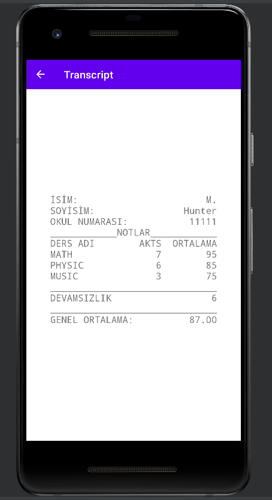

# SchoolPortal
It is an android application designed for students and teachers. Teachers registered in the system can change the grades and absenteeism of the students and see the transcript of the student. Students registered in the system can view the transcript.

## Prerequisites
This project requires JDK

## Setup/Installation
1. Clone this repo into your own workspace.
2. Open the project using IDEA or VS Code
3.  Run

